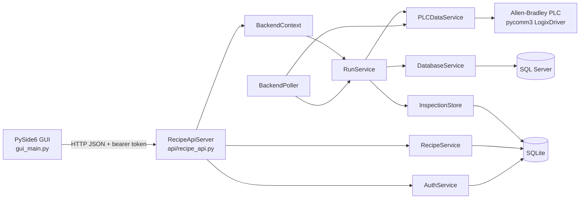

# Architecture

## Current Production Boundary

## Components

### ApiClient

`services/api_client.py::ApiClient` centralizes GUI HTTP requests, bearer
authentication, JSON serialization, timeouts, and backend error handling.

### API handler/server

`api/recipe_api.py::_Handler` exposes authentication, operation, PLC, SQL,
settings, recipe, and user routes. `RecipeApiServer` owns the HTTP server
thread. Authorization is delegated to `AuthService`.

`GET /health` is a backend readiness endpoint. It returns success only when
the HTTP server has a `BackendContext` and the required backend service
objects—RunService, PLCDataService, DatabaseService, InspectionStore,
RecipeService, AuthService, and BackendPoller—are initialized and available to
the API. It does not require live PLC or SQL Server connectivity; those states
remain separate operational status values.

### BackendContext

`api/backend_context.py::BackendContext` is the API façade for operation state,
connection status/tests, settings, and the backend-owned services.

### RunService

`services/run_service.py::RunService` owns four `LotState` objects, scan
validation, SQL result assignment, recipe resolution, PLC payload construction,
load/clear/end operations, recovery, and state snapshots.

### BackendPoller

`services/backend_poller.py::BackendPoller` is the production PLC polling loop.
It prevents overlapping polls and sends changed PLC state to `RunService`.

### PLCDataService

`services/plc_data_service.py::PLCDataService` is the only backend abstraction
for `pycomm3.LogixDriver`, PLC tag generation, recipe preparation, tray writes,
reads, raw-value mapping, and identity observations.

### DatabaseService

`services/database_service.py::DatabaseService` performs the parameterized
SQL Server PO lookup and `SELECT 1` connection test.

### InspectionStore

`services/inspection_store.py::InspectionStore` owns SQLite inspection tables,
transactions, immutable snapshot triggers, event history, polling updates,
clear/end behavior, and recovery rows.

### RecipeService

`services/recipe_service.py::RecipeService` owns SQLite recipe mappings and
Recipe.xlsx import/list/create/update/delete operations.

### AuthService

`services/auth_service.py::AuthService` owns the SQLite users table, password
hashing, in-memory sessions, role checks, initial Admin creation, and audit
logging. Sessions use the current default eight-hour lifetime, are accepted via
Bearer token or the `HttpOnly` session cookie, and are removed by logout.
Sessions are intentionally not persisted; restarting the backend invalidates
active sessions.

## Ownership Rule

The production GUI communicates with the backend through HTTP. It must not own:

- PLC connections or PLC polling
- SQL Server or SQLite access
- `RunService` state
- inspection persistence
- recipe/user storage

The backend is the authoritative owner of active run state and PLC polling.

## Legacy Modules

The following are retained as LEGACY direct-service code:

- `legacy/ui/main_window.py`
- `legacy/ui/operation_page.py`
- `legacy/ui/workers.py`

They contain direct service references and Qt PLC timers, but are not reached by
the current `main.py` compatibility shim or `gui_main.py` production path.
They are physically isolated under `legacy/`.
